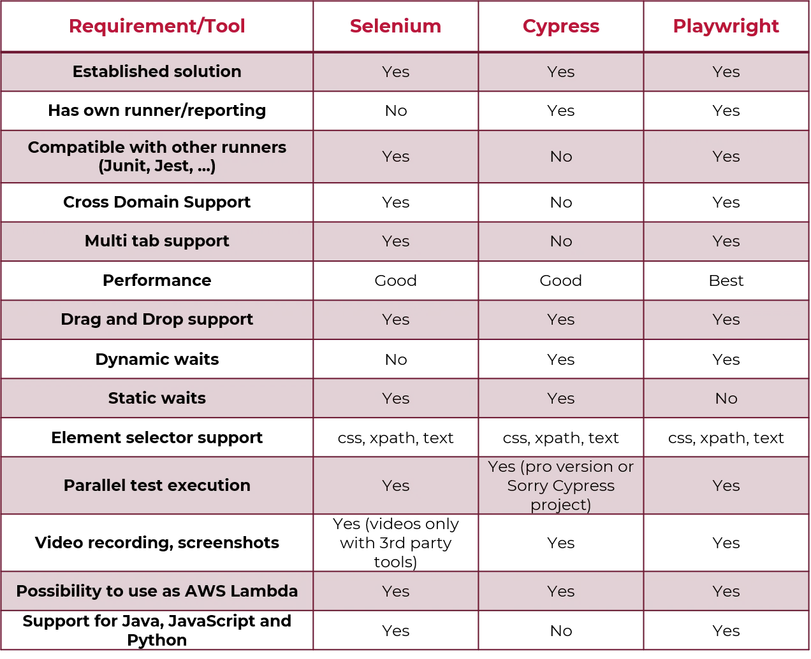

## Selenium

Selenium is an open-source suite of tools for testing web applications across different browsers. It was created by Thoughtworks in 2004 and is dedicated to browser application testing. Its components include Selenium Grid, IDE, RC, and WebDriver, supporting browsers like Chrome, Firefox, Safari, and more. Selenium scripts are written in JavaScript, Java, Ruby, C#, or Python.

### Benefits of Selenium:

1. Open source nature amplifies its advantages.
2. Supports popular programming languages: Java, Python, JavaScript, C#, Ruby, Perl.
3. Compatible with major browsers: Firefox, Chrome, Safari, IE, Opera, Edge.
4. User-friendly interface for easy script creation and execution.
5. Reusable test suites across different browsers and OSs.

### Limitations of Selenium:

1. No support for desktop app automation.
2. Reliance on community forums for technical help due to open-source nature.
3. Inability to automate tests for web services like SOAP or REST.
4. Requires familiarity with supported programming languages for WebDriver scripting.
5. Lacks built-in reporting; relies on external plugins like JUnit and TestNG.
6. Cannot perform image testing; requires integration with Sikuli for image-based tests.

## Cypress

Cypress provides a seamless developer experience within an integrated environment.Unlike Selenium, which demands installing various components (Selenium, drivers, libraries) for end-to-end testing, Cypress streamlines the process. This spares testers the laborious framework setup and configuration challenges. Cypress offers a fresh approach to eliminate configuration complexities.

### Benefits of Cypress:

1. Strong E2E testing support.
2. Command Log with step details.
3. Utilize Developer Tools for debugging.
4. Automated waits and assertions.
5. Effortlessly handle functions, server responses, and timers.
6. Convenient access to unit testing features.
7. Efficient control, stubbing, and edge case testing.

### Limitations of Cypress

1. Exclusive support for JavaScript in test creation.
2. Limited iframe compatibility.
3. Lacks multi-tab support.
4. Unsuitable for extensive cross-platform E2E tests due to browser-centric approach.

More infirmation on Why Cypress, can be found [here](https://docs.cypress.io/guides/overview/why-cypress)

## Playwright

Developed by the creators of Puppeteer, Microsoft Playwright stands out for its cross-browser testing capabilities. While sharing similarities with Puppeteer, Playwright goes beyond by efficiently handling Chrome, WebKit, and Firefox browsers.

Playwright's versatility extends to Windows, MacOS, and Linux. It seamlessly integrates with testing frameworks like Jest, Mocha, and Jasmine, easily fitting into CI pipelines through a unified API. Playwright supports multiple languages, including TypeScript, JavaScript, Python, and Java. Additionally, it liberates testers from complex framework setup and configuration tasks.

Precision-engineered for the modern web, Playwright operates swiftly, even in intricate testing endeavors.

### Benefits of Playwright:

1. Intuitive syntax and functional flexibility.
2. Deep integration with modern browser structures.
3. Offers developer access akin to end-users.
4. Auto-wait function minimizes test failures.

### Limitations of Playwright:

1. No support for older Edge or IE11.
2. Capturing media and errors per test, not entire root test.
3. API testing lacks follow redirect disabling.
4. Mobile emulation employs desktop browsers, not actual devices.

For more information on Why Playwright, can be found [here](https://playwright.dev/docs/why-playwright)

### Comparasion table

